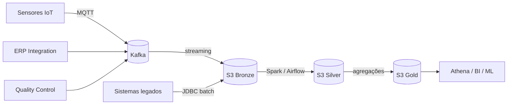

# Arquitetura

## Visão de contexto

## Camadas do lake

- **Bronze:** dado bruto exatamente como chegou, particionado por fonte e data. Imutável.
- **Silver:** dado limpo e deduplicado, schema validado contra o registry, tipado em Delta Lake.
- **Gold:** agregações de negócio (OEE por linha, giro de estoque, lead time de fornecedores) prontas para BI.

## Decisões relevantes

- **Schema Registry obrigatório:** todo tópico consumido precisa de schema Avro registrado; mensagens incompatíveis vão para quarentena em vez de quebrar o pipeline.
- **Backfill idempotente:** DAGs aceitam reprocessamento por intervalo de partição sem duplicar dados (merge Delta por chave natural).
- **Dados de sensores nunca expiram no bronze** — exigência de rastreabilidade industrial.
