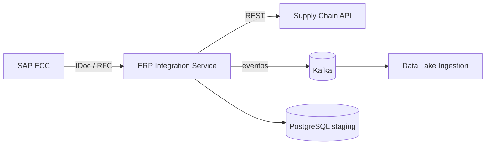
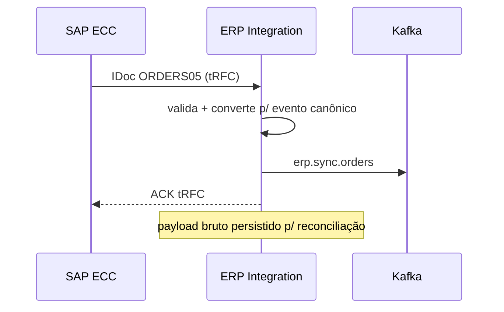

# Arquitetura

## Visão de contexto

## Padrões de integração

- **Inbound (SAP → plataforma):** IDocs recebidos via tRFC, convertidos para eventos canônicos e publicados no Kafka. O staging em PostgreSQL guarda o payload bruto para reconciliação.
- **Outbound (plataforma → SAP):** chamadas BAPI via JCo com retry exponencial e circuit breaker (Resilience4j). Falhas vão para a fila `erp.sync.dlq` com alerta automático.

## Reconciliação

Job diário (4h BRT) compara totais de pedidos e movimentos de estoque entre o staging e o SAP. Divergências geram relatório no canal `#erp-reconciliation` e ficam visíveis no dashboard Grafana.

