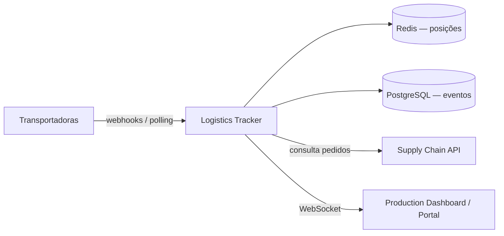
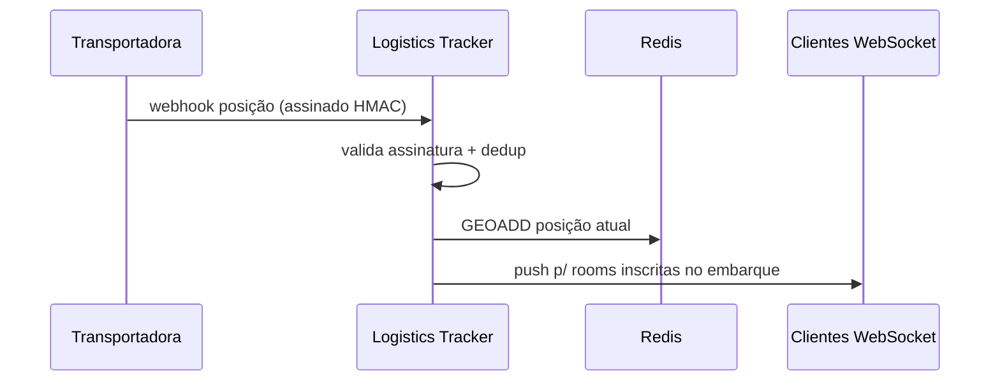

# Arquitetura

## Visão de contexto

## Fluxo de atualização de posição

## Decisões relevantes

- **Redis como fonte de leitura quente:** o frontend nunca consulta PostgreSQL para posição atual; o histórico fica no Postgres para auditoria e analytics.
- **Dedup por `(carrier, shipmentId, timestamp)`:** transportadoras tier-2 reenviam posições no polling; eventos duplicados são descartados antes do fan-out.
- **Backpressure no WebSocket:** atualizações são agregadas em janelas de 5s por embarque para não saturar clientes móveis.
