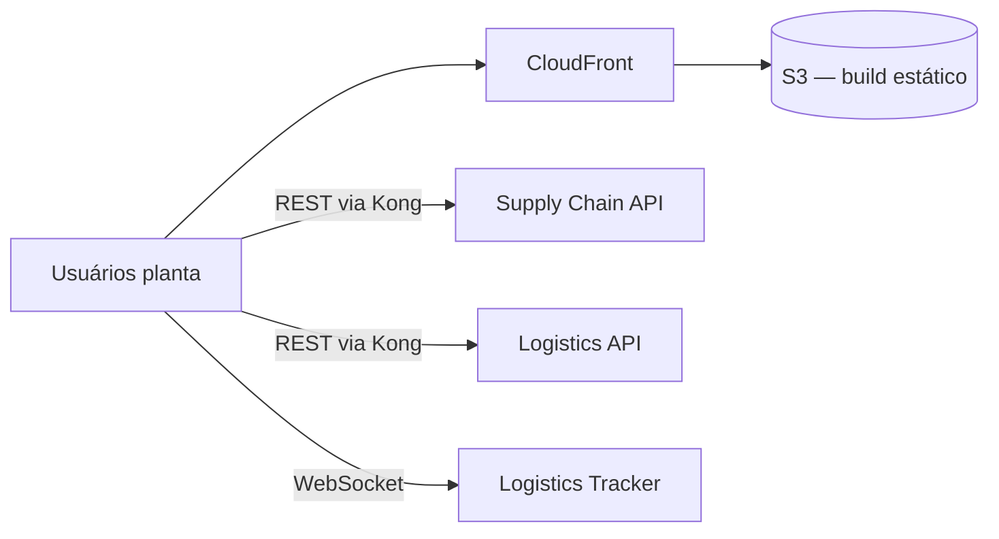

# Arquitetura

## Visão de contexto

## Estrutura do código

- **`features/`** — módulos por domínio (plant-view, shipments, quality, alerts), cada um com rotas, queries e componentes próprios
- **`shared/`** — autenticação OIDC, cliente HTTP com refresh de token, conexão WebSocket com reconexão
- **`@indorama/ui`** — design system versionado em pacote separado

## Decisões relevantes

- **Polling + WebSocket híbrido:** KPIs agregados via TanStack Query (refetch 30s); somente posição de embarque usa WebSocket — reduz conexões persistentes.
- **Modo quiosque:** telas de chão de fábrica rodam com auto-login por device token e rotação automática de telas (query param `?kiosk`).
- **Feature flags:** novas telas atrás de flags (Unleash) para rollout por planta.
