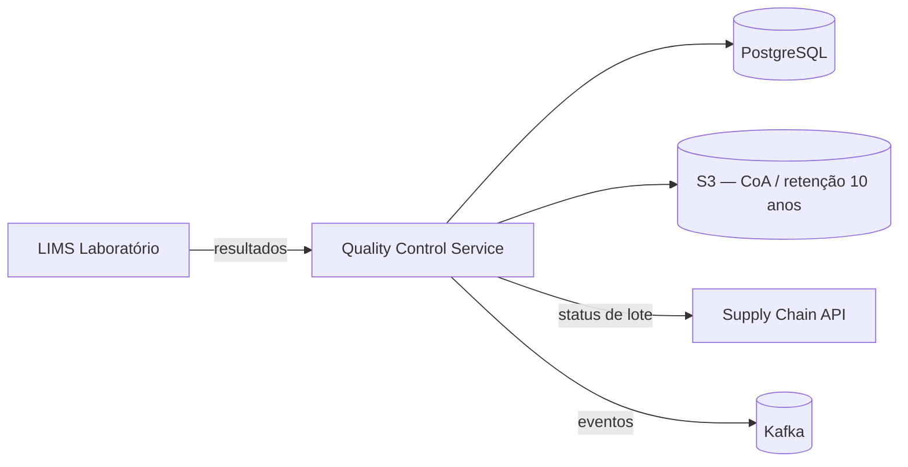
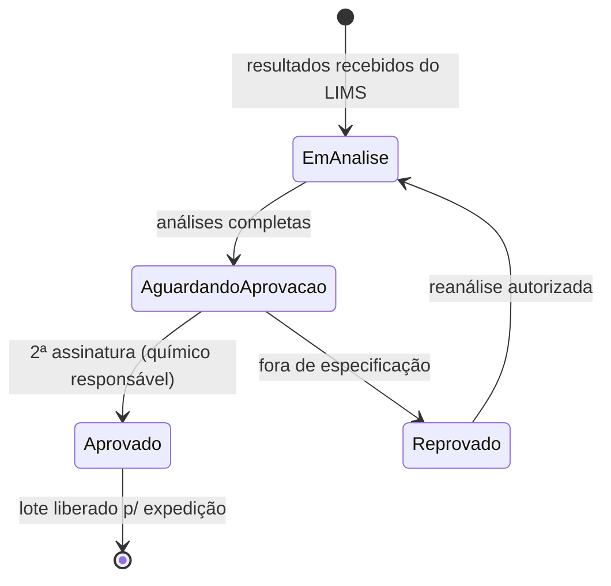

# Arquitetura

## Visão de contexto

## Workflow de aprovação de laudo

## Decisões relevantes

- **Imutabilidade de laudos:** laudo aprovado nunca é editado; correções geram nova versão com referência à anterior (exigência de auditoria).
- **Particionamento por planta:** tabelas de análise particionadas por `plant_id` — consultas regulatórias varrem anos de histórico de uma única planta.
- **Bloqueio de expedição via evento:** a liberação/bloqueio de lote é propagada por evento Kafka consumido pela Supply Chain API; não há acoplamento síncrono no caminho de expedição.
