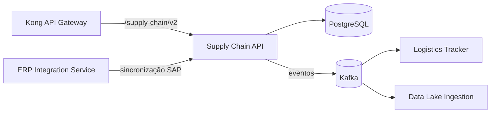
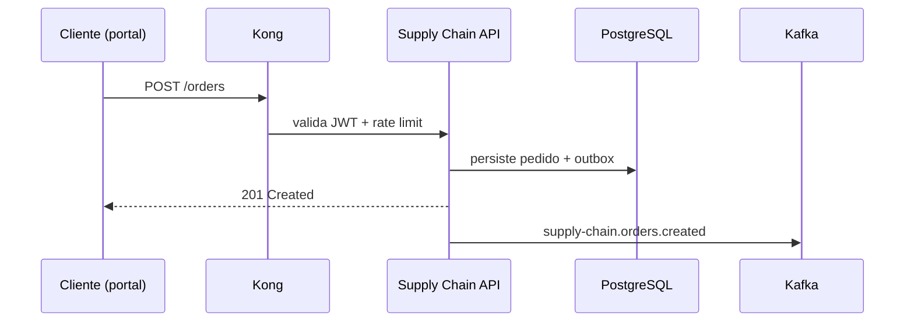

# Arquitetura

## Visão de contexto

## Camadas

A aplicação segue arquitetura hexagonal:

- **`api/`** — controllers REST, validação de payload, mapeamento DTO
- **`domain/`** — entidades de negócio, regras de aprovação de pedidos, políticas de estoque
- **`infrastructure/`** — repositórios JPA, producers Kafka, clients HTTP para o SAP

## Decisões relevantes

| ADR | Decisão | Status |
|---|---|---|
| ADR-001 | PostgreSQL como fonte de verdade; SAP sincronizado via eventos | Aceita |
| ADR-004 | Outbox pattern para publicação confiável no Kafka | Aceita |
| ADR-007 | Idempotência por `Idempotency-Key` em todos os POSTs | Aceita |

## Fluxo de criação de pedido

